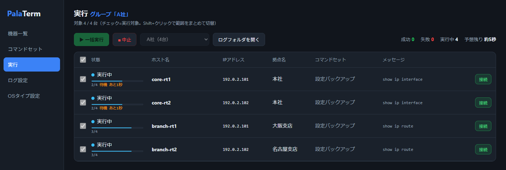
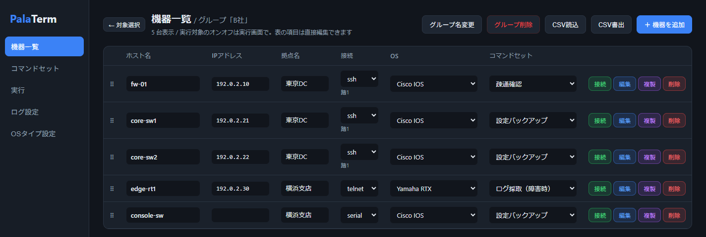

# PalaTerm

**Parallel SSH / Telnet / Serial Access — batch login tool for network engineers.**

English version: [README.md](README.md)

複数のネットワーク機器（Cisco IOS/ASA・JUNOS・FortiGate・HPE・NEC IX・Yamaha RTX など）に SSH / Telnet / シリアルで一括ログインし、
ログ取得・コマンド一括実行・設定変更を並列で行うWindows用ツールです。Tera Term マクロや手作業のログ採取の置き換えを想定しています。
単一のポータブルexeで動作し、インストール不要です。紹介ページ: https://kojio145.github.io/palaterm/

> **開発状況: v1.5.8（β）。** 動作しますが荒削りな部分があります。Issueでのフィードバック歓迎です。

## 特徴

- 🖥 **同時ログイン**: 機器リストの全機器へ並列接続（同時実行数は調整可能）
- 📡 **3つの接続方式**: SSH / Telnet / シリアルコンソール（COMポート自動探索）
- 🏢 **踏み台対応**: 踏み台サーバ経由の多段接続（SSH公開鍵認証対応: Ed25519/RSA/ECDSA・古い踏み台向けの旧形式DSA・パスフレーズ付き鍵可）
- 🤖 **ログイン自動化**: Cisco IOS/ASA・JUNOS・FortiGate・HPE・NEC IX・ALAXALA AX・Yamaha RTX など15種のOSプロファイル内蔵。enable昇格・ページャ無効化まで自動。全プロファイル編集可・自作追加可
- 📋 **コマンド一括実行**: 名前付きコマンドセットを機器ごとに割当てて一括実行
- 📁 **ログ自動保存**: `{host}_{site}_{role}_{stage}_{date}_{time}.txt` 形式（プレースホルダでカスタム可）
- 🕘 **実行履歴と作業前後の比較**: 作業前／作業中／作業後を選んで実行し、同じ機器の作業前・作業後のログを差分表示（時刻・カウンタの違いは無視）
- ⚠️ **設定変更コマンドの事前警告**: `conf t` / `write` / `reload` などを含むセットは実行前に警告。接続確認だけのドライランも可
- 🏢 **グループ既定の認証情報**: 会社ごとの共通アカウントを一度だけ登録、機器ごとに個別設定も可
- 🔒 **認証情報の暗号化保存**: マスターパスワードによるAES-256-GCM暗号化（平文保存なし）
- 💻 **対話接続**: 1台にログイン自動化まで済ませてから手動操作に引き継ぐ内蔵ターミナル（xterm.js）
- 🌐 **日本語 / 英語 UI**
- 🚫 **外部通信ゼロ**: テレメトリなし・自動更新なし。社内ネットワークでの利用を想定した設計

## 動作環境

- Windows 10 / 11（x64）。WebView2ランタイムを使用します（Windows 10/11には標準搭載）。

## インストール

不要です。[Releases](../../releases) から `PalaTerm-vX.Y-win64.zip` をダウンロードして展開し、できた `PalaTerm` フォルダごと好きな場所（例: `C:\Tools\PalaTerm`）に置いて、中の `PalaTerm.exe` を実行してください。vault・ログ・書き出しはそのフォルダの中に作られるので、exe の周りが散らかりません。更新用に `PalaTerm.exe` 単体も添付しています（フォルダはそのまま、exe だけ差し替え）。
PalaTerm のデータ（暗号化vault・ログ・書き出しファイル）はすべて exe の隣に作られます。
唯一の例外は WebView2 ランタイム自身のブラウザキャッシュで、Windows が
`%APPDATA%\PalaTerm.exe\EBWebView\` に作ります（PalaTerm のデータは含まれません）。
アンインストールは exe のフォルダを削除するだけです（必要ならこのキャッシュフォルダも削除してください）。

無署名exeのため、初回実行時にMicrosoft Defender SmartScreenの警告が出ることがあります
（「詳細情報」→「実行」で起動できます）。コード署名は導入予定です。

## ドキュメント

- [利用マニュアル](docs/manual.html)
- [使い方ガイド](docs/USAGE.md) / [ビルド手順](docs/BUILD.md)
- [セキュリティレビュー記録](docs/SECURITY.md) — 脆弱性の報告方法は [SECURITY.md](SECURITY.md) を参照
- [開発記（Zenn）](https://zenn.dev/kjo145/articles/palaterm-batch-login-go-wails) — 設計方針・作業前後の照合・実機検証で踏んだバグ・配布の壁

## サポート方針

個人が余暇で開発しているツールです。Issue・機能要望は読みますが、対応は不定期です。
即日の回答は期待しないでください。

## ライセンス

MIT License. 商用利用可。詳細は [LICENSE](LICENSE) を参照してください。
同梱サードパーティライセンス: [THIRD-PARTY-NOTICES.md](THIRD-PARTY-NOTICES.md)

**免責**: 本ツールはネットワーク機器への接続・設定変更を自動化します。
利用によって生じたいかなる損害についても作者は責任を負いません。
本番機器への利用は、必ず検証環境での動作確認と所属組織のルール確認のうえで行ってください。
