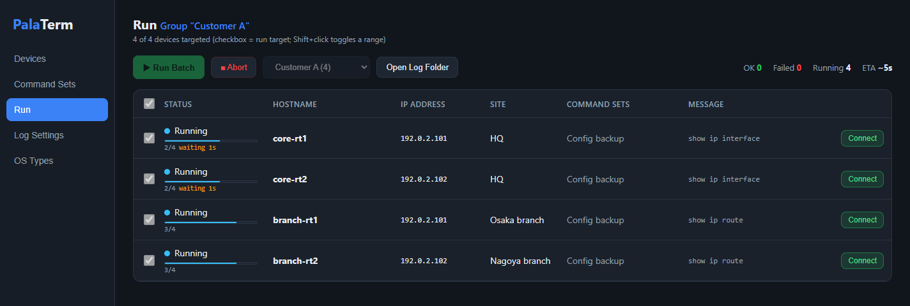
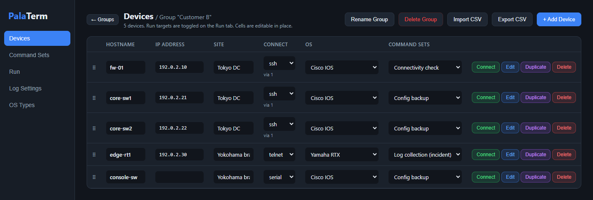

# PalaTerm

**Parallel SSH / Telnet / Serial access — batch login tool for network engineers.**

日本語版は [README.ja.md](README.ja.md) を参照してください。

> 複数のネットワーク機器（Cisco IOS/ASA・JUNOS・FortiGate・HPE・NEC IX・Yamaha RTX など）に SSH / Telnet / シリアルで一括ログインし、
> コマンドセットを並列実行してログを自動保存する Windows 用ツールです。Tera Term マクロや手作業のログ取得の置き換えを想定しています。
> 紹介ページ: https://kojio145.github.io/palaterm/

PalaTerm logs in to many network devices at once to collect logs, run command sets,
and apply configuration changes in parallel. It ships as a single portable
Windows exe — no installation required.

> **Status: v1.5.1 (beta).** It works, but expect rough edges. Feedback via Issues is welcome.

## Features

- 🖥 **Parallel login** — connect to every device in your list at once (concurrency is adjustable)
- 📡 **Three transports** — SSH / Telnet / serial console (COM ports auto-discovered)
- 🏢 **Jump host support** — multi-hop connections through bastion servers
  (SSH public-key auth: Ed25519/RSA/ECDSA, passphrase-protected keys supported)
- 🤖 **Login automation** — 14 built-in OS profiles (Cisco IOS/ASA, JUNOS, FortiGate,
  HPE, NEC IX, Yamaha RTX, …) handling enable escalation and pager disabling; all
  profiles are editable and you can add your own
- 📋 **Batch command execution** — assign named command sets per device and run them in one go
- 📁 **Automatic log saving** — `{host}_{site}_{stage}_{date}_{time}.txt` style, customizable with placeholders
- 🕘 **Run history & before/after diff** — tag a run as before / during / after the work, then compare
  the before and after logs per device (clock and counter noise ignored)
- ⚠️ **Change guard** — a command set that contains `conf t` / `write` / `reload` … is called out
  before the batch starts; a connect-only dry run checks credentials without sending a command
- 🏢 **Group default credentials** — one shared account per group, with per-device overrides
- 🔒 **Encrypted credential vault** — AES-256-GCM protected by a master password (nothing stored in plain text)
- 💻 **Interactive terminal** — automate the login to a single device, then take over
  manually in a built-in terminal (xterm.js)
- 🌐 **English / Japanese UI**
- 🚫 **Zero external communication** — no telemetry, no auto-update; designed for use inside closed networks

## Requirements

- Windows 10 / 11 (x64). Uses the WebView2 runtime, which is preinstalled on Windows 10/11.

## Installation

None needed. Download `PalaTerm-vX.Y-win64.zip` from [Releases](../../releases), extract it, and put the `PalaTerm` folder wherever you like (e.g. `C:\Tools\PalaTerm`). Run `PalaTerm.exe` inside it — the vault, logs and exports are created in that folder, so nothing is scattered around the exe. The bare `PalaTerm.exe` is also attached for updating in place: replace the exe, keep the folder.
All PalaTerm data (encrypted vault, logs, exports) is written next to the exe.
The only exception is the WebView2 runtime's own browser cache, which Windows keeps
under `%APPDATA%\PalaTerm.exe\EBWebView\` (no PalaTerm data is stored there).
To uninstall, delete the exe folder and, optionally, that cache folder.

Unsigned executables may trigger a Microsoft Defender SmartScreen warning on first
launch ("More info" → "Run anyway"). Code signing is planned.

## Documentation

- [User manual](docs/manual.html) (Japanese)
- [Usage guide](docs/USAGE.md) / [Build instructions](docs/BUILD.md)
- [Security review record](docs/SECURITY.md) — see [SECURITY.md](SECURITY.md) for how to report vulnerabilities
- [Development story on Zenn](https://zenn.dev/kjo145/articles/palaterm-batch-login-go-wails) (Japanese) — design, before/after verification, bugs found on real devices, distribution hurdles

## Support

This is a spare-time project. Issues and feature requests are read, but responses
and fixes happen on an irregular schedule — please don't expect same-day answers.

## License

MIT License — commercial use permitted. See [LICENSE](LICENSE).
Bundled third-party licenses: [THIRD-PARTY-NOTICES.md](THIRD-PARTY-NOTICES.md).

**Disclaimer**: This tool automates connections to and configuration changes on
network equipment. The author accepts no liability for any damage arising from its
use. Before using it against production devices, test in a lab environment and
confirm your organization's rules.
